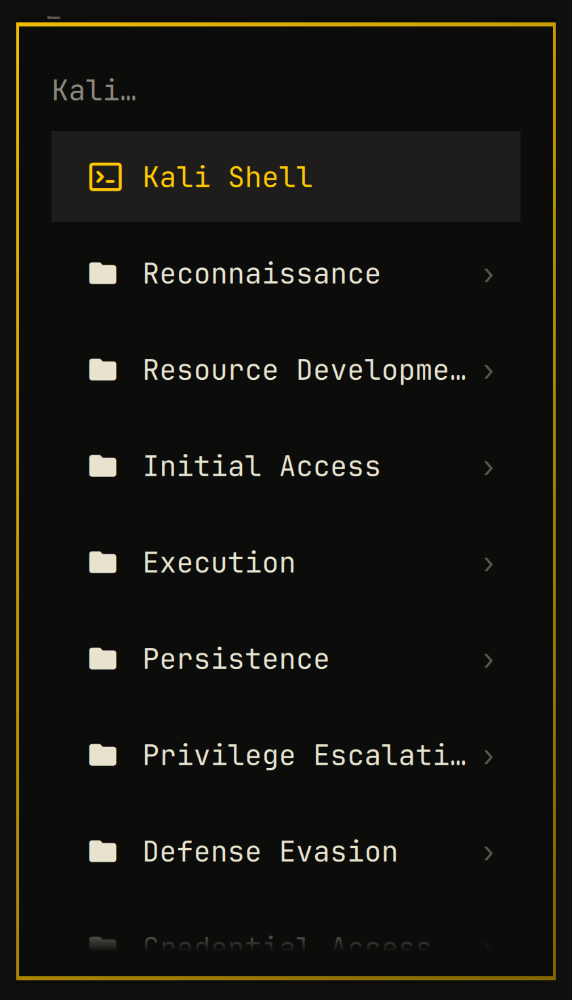

# Kali Tools for the Omarchy menu

Your whole Kali toolkit, one `Super`-press away, laid out exactly the way Kali
lays it out — all from a [distrobox](https://distrobox.it/) container, without a
single security tool touching your host.

[Omarchy](https://omarchy.org/) is a genuinely lovely thing to build on. The menu
is declarative, it hot-reloads the moment you save, and the whole system is
readable if you go looking. This plugin is a love letter to that: ~440 rows of
Kali, generated, filtered, and dropped into the menu you already use.

<p align="center">
  
</p>

```
Kali
├── Reconnaissance
│   ├── Host Information
│   ├── Network Information
│   ├── Network Information: DNS
│   └── ...
├── Resource Development
├── Initial Access
├── Execution
├── Persistence
├── Privilege Escalation
├── Defense Evasion
├── Credential Access
├── Discovery
├── Lateral Movement
├── Collection
├── Command and Control
├── Exfiltration
├── Impact
├── Forensics
├── Services and Other Tools
└── Settings
    ├── Refresh menu
    ├── Doctor
    └── Container
```

## The nice part: Kali already did the hard work

The `kali-menu` package ships **539 `.desktop` launchers** with a full kill-chain
category tree — and they are thoughtfully built, pointing at a guided wizard
where one exists (`sqlmap --wizard`) and `--help` where one doesn't. All this
does is read that out of your container and translate it into menu rows.

**Only tools you actually have get listed.** `kali-menu` describes Kali's entire
catalogue rather than your install, so on a typical container about a third of
those launchers point at nothing. Those are filtered out, along with the service
entries that can't work in a container. What's left should all *work*.

And because rows are generated from what's installed, a smaller metapackage gives
you a smaller menu rather than a broken one.

## A fun project, and what that means for you

This started as "can I get Kali tools into the Omarchy menu?" and turned into a
long, enjoyable rabbit hole. It works well for me, every day. But please read
this before trusting it with anything:

- **It has run on exactly one machine.** Mine. x86_64, Omarchy 4.0.2, Hyprland.
  Every measurement in this README is a sample of one.
- **Omarchy 4.0.2 is what it was built against.** It reads and writes Omarchy's
  menu extension file and depends on specifics of its shell. Newer versions are
  unverified — please open an issue rather than assume it's broken by design.
- **Nobody has watched every GUI app draw a window.** The automated checks
  confirm binaries load and libraries resolve; they can't confirm pixels.
- **No warranty, MIT, hobby project.** If it eats your menu file, there's a
  timestamped backup next to it — but you are the backup of last resort.

### Use these tools responsibly

This puts a few hundred security tools one click away. That's the fun of it, and
also the responsibility: **only use them against systems you own or have explicit
written permission to test.** Port scanning, credential attacks and exploitation
against machines you don't have authorisation for is illegal in most
jurisdictions. Nothing here changes that, and making the tools convenient doesn't
make them appropriate.

Not affiliated with, or endorsed by, Kali Linux/OffSec or Omarchy/37signals.

## What it does on your machine

Worth knowing before you enable it — none of it is hidden, but you should hear it
from the README rather than discover it.

**It runs commands as you.** Like any Omarchy plugin it is unsandboxed code in
the shell process — `omarchy plugin add` warns about this. Concretely: when the
Kali container is **already running**, it shells out at login to regenerate the
menu. If the container is stopped it does nothing and leaves your last rows in
place; it will not start a 12-22 GB container behind your back.

The generated menu rows also invoke `distrobox` on your behalf when clicked,
which is the entire point, but worth knowing before you enable it.

## Install

Needs Omarchy, `distrobox`, and a container manager. distrobox autodetects
podman, docker or lilipod, and this follows whatever it picks — `podman` is the
usual choice on Arch, and `DBX_CONTAINER_MANAGER` overrides the detection for
both.

```bash
omarchy plugin add https://github.com/gianandr4/omarchy-kali
omarchy plugin enable fygas.kali
```

You need a Kali distrobox with the `kali-menu` package in it. If you have one
already:

```bash
distrobox enter kali -- sudo apt install kali-menu
```

If you don't, `container/setup.sh` builds one (see below). Then:

```bash
~/.config/omarchy/plugins/fygas.kali/bin/kali-menu link   # put the commands on PATH
kali-menu sync                                            # build the rows

# optional: keep the menu in step after `omarchy update`
omarchy hook install post-update ~/.config/omarchy/plugins/fygas.kali/hooks/kali-menu-sync.hook
```

The menu hot-reloads; no restart. Point it at a differently-named container with
`KALI_CONTAINER=<name>`.

## Commands

| | |
|---|---|
| `kali-menu sync` | regenerate the rows |
| `kali-menu use <container>` | switch container and rebuild for it |
| `kali-menu doctor` | check the install and say what's wrong |
| `kali-menu uninstall` | remove rows and symlinks — **run before `omarchy plugin remove`** |
| `kali-run 'nmap --help'` | run a tool, then land in a shell with `nmap ` already typed |
| `kali-gui burpsuite` | launch a GUI app from the container |
| `kali-update` | upgrade the container, then resync |
| `kali-update --install btop` | install packages and resync in one step |

Rows are written between sentinel comments in
`~/.config/omarchy/extensions/omarchy-menu.jsonc`; anything you hand-write
outside that block is preserved, and a timestamped backup is kept each run.

## Using more than one container

`Kali → Settings → Container` lists every distrobox on the machine and ticks the
one in use. Picking another switches to it and rebuilds the menu.

The rebuild is not optional: rows are filtered by what is installed in the
container they were generated from, so pointing at a different one without
regenerating would leave rows for tools it may not have.

The choice is stored in `~/.local/state/omarchy-kali/container` and honoured by
all four commands. `KALI_CONTAINER=<name>` still overrides it for one-offs. The
submenu only appears when there is more than one container to choose from.

## Building a container

```bash
container/setup.sh                                 # kali-linux-default
METAPACKAGE=kali-linux-large container/setup.sh    # everything short of the kitchen sink
```

How much menu each metapackage gives you. The two marked *built* are measured
from real builds of this Containerfile; the others are estimated from apt's
dependency closure and will come out somewhat higher in practice, because the
image also installs `kali-linux-headless` explicitly and apt pulls recommends.

| Metapackage | Packages | Menu entries | Image |
|---|---|---|---|
| `kali-linux-core` | ~340 | ~2 — too small to be useful | |
| `kali-linux-headless` | ~1,700 | ~170 est. | |
| `kali-linux-default` | 2,431 | **292** *(built)* | 12.8 GB |
| `kali-linux-large` | 2,889 | **436** *(built)* | 21.9 GB |

A smaller metapackage gives a smaller menu, not a broken one. `large` roughly
doubles the image for about 50% more tools.

Both measured figures come from one machine, at one point in Kali rolling's
life. Expect them to drift.

## Uninstall

```bash
kali-menu uninstall                  # removes the rows and the symlinks
omarchy plugin remove fygas.kali
```

Run them in that order. `omarchy plugin remove` is an `rm -rf` with no uninstall
hook, so anything outside the plugin directory is yours to clean up. If you
forget, nothing breaks: the generated rows are guarded on the plugin directory
existing, so they disappear from the menu the moment it does.

## Service entries need a booted systemd

Kali ships launchers that start services — `beef-xss-start`, `dradis-start`,
`faraday-start`, `gophish-start`, `starkiller-start` and their `-stop` partners.
They cannot work in a normal distrobox.

distrobox runs systemd as the container's PID 1 but never **boots** it, so
`/run/systemd/system` is absent and `systemctl is-system-running` reports
`offline`. Every one of those entries dies with:

```
System has not been booted with systemd as init system (PID 1). Can't operate.
```

The tools are installed and the scripts are executable, so a presence check
cannot see it. They are detected instead by what they call — Kali's own
`kali-service-start`/`-stop` helper, or `systemctl` directly — and dropped.

**If your container does boot systemd** (`distrobox create --init`), they are
kept, because there they work. The check is made against the container, not
assumed.

`iodine-client-start` looks like one of these and is not — it configures a
tunnel directly, and stays in the menu.

Entries that escalate with `pkexec` in command position are dropped for the same
reason: no polkit agent means they hang without even an error. `armitage` is the
one this catches. `wireshark` mentions `pkexec` too but only as a fallback when
you are not in the `wireshark` group — and `setup.sh` puts you in it, so it takes
the direct path and stays.

## Things that cost real time to find

Honestly the best part of the project. Every one of these cost an evening, and
they're all useful if you run Kali in a distrobox at all — with or without this
plugin. Written down so you don't have to rediscover them.

**Don't run GUI apps as root in the container.** Debian's
`libpixbufloader_svg.so` links `libglycin`, so every SVG icon in a GTK app is
decoded by a helper inside a `bwrap` sandbox. As root that helper exits 1 and GTK
aborts on the assert in `gtkiconhelper.c` — zenmap builds its entire main window,
then dies with SIGABRT. As your user it is fine. Qt apps are unaffected.

Root is usually unnecessary anyway, though not for the obvious reason.
`/usr/bin/nmap` is a 165-byte wrapper; the real binary at `/usr/lib/nmap/nmap`
carries `cap_net_raw,cap_net_admin,cap_net_bind_service=eip`, and the wrapper
passes `--privileged` when you are not root so nmap trusts those caps. The
container's `--cap-add` only puts them in the **bounding set**, which is what
lets the file caps take effect — your shell never holds them, and a plain
process still gets `PermissionError` opening a raw socket. The upshot is that
`nmap -sS` really does run a SYN scan as you, byte-identical to the output
under `sudo`.

**Zenmap's "you are not root" warning is a false alarm here.** It checks
`os.getuid() == 0` (`zenmapGUI/App.py:146`) and knows nothing about file
capabilities, so it warns even though the scans it drives work fine. Dismiss it.

**Wireshark needs its group creating.** `wireshark-common`'s debconf step never
runs in a non-interactive image build, so the `wireshark` group is never created
and `dumpcap` keeps root-only permissions. Kali's launcher checks that group and
falls back to `pkexec wireshark` — which hangs forever. `setup.sh` now does what
debconf would have: creates the group, adds you to it, and gives `dumpcap`
`cap_net_raw,cap_net_admin`. That also lets you capture without being root.

**`pkexec` cannot work in the container** — there is no polkit agent, so it hangs
on a prompt nobody can answer. Kali's `pkexec` launchers are rewritten to run as
you. The exceptions are `fern-wifi-cracker`, which writes under `/usr/share` and
genuinely needs root, and `legion`, which checks `os.getuid()` itself and refuses
to start without it ("Legion must run as root for raw socket access"). Both are
Qt, so both tolerate it.

**distrobox's init creates `~/.config` and friends as root**, which lands on the
host as an unwritable uid. theHarvester, wfuzz, hashcat and scapy all die with
`PermissionError` until that is fixed. `setup.sh` fixes it after init — it cannot
be done in the `Containerfile`, because the home is bind-mounted in after the
image is built.

**Purge `rpm` from the image.** distrobox finds both `apt-get` and `rpm`, takes
its ALT Linux code path, tries to install packages that do not exist in Kali, and
init fails with exit 100.

**`--unshare-netns` is required.** distrobox defaults to the host netns, where
`NET_ADMIN`/`NET_RAW` granted in a rootless userns do not apply — so openvpn's
tun creation and `nmap -sS` both fail with EPERM.

**`omarchy plugin remove` runs no uninstall hook**; it is an `rm -rf`. The rows
would outlive the plugin, so the root row is guarded on the plugin directory
still existing — remove the plugin and the tree disappears. `kali-menu uninstall`
cleans up properly.

## Design note: why rows are generated, not served

I really wanted to use a runtime `provider` here. It would have been elegant.
It is also, sadly, not possible.

The menu's `provider:` field is **not** a user extension point, despite what the
comment in `omarchy-menu.jsonc` says. `Menu.qml` defines a `readonly` map of
exactly three (`fonts`, `power-profiles`, `apps`); an unknown key is silently a
no-op, rows are tab-delimited rather than JSON, and each provider's action comes
from a QML function. Writing the JSONC is the only path to menu rows, so the rows
are generated rather than served.

## Troubleshooting

```bash
kali-menu doctor            # what is wrong, with a suggested fix per failure
kali-menu doctor --json     # same, machine-readable
kali-menu skill install     # install the troubleshooting skill for Claude Code
```

`skills/omarchy-kali/SKILL.md` documents every failure mode above plus the ones
that are hard to diagnose cold — it is worth reading even if you never use an
agent.

## Verifying

```bash
kali-menu doctor      # the live install
test/regression       # 21 checks, each one a bug this shipped
```

Not covered by either: whether a GUI app actually draws a window, and the handful
of entries that start services. Those need a human.

## Contributing

Issues and PRs very welcome, especially "this broke on Omarchy X.Y" or "this
failed on hardware you don't own" — those are exactly the gaps a one-machine
project has. `AGENTS.md` has the orientation, and `test/regression` should stay
green.

## Licence

MIT — see [LICENSE](LICENSE). Kali Linux and its tools are the work of
[OffSec](https://www.kali.org/), under their own licences; Omarchy is by
[37signals](https://omarchy.org/). This is an unaffiliated third-party plugin.
